# Starter Kits

A comprehensive collection of React.js and Node.js starter kits and boilerplates for rapid application development. Built in May 2020, featuring modern web technologies including React.js, Node.js, Redux, Redux-Thunk, Redux-Saga, Redux-Toolkit, React Hooks, localStorage, Socket.io, SCSS, Express.js, Mongoose.js, and more.

Perfect as boilerplate templates for interviews, learning, or starting new projects quickly.

## Architecture Overview

```mermaid
graph TB
    subgraph "Starter Kits Repository"
        ROOT[Root Directory]
        
        subgraph "Client Kits"
            CE[client-hooks-empty]
            CRT[client-hooks-redux-thunk]
            CRTK[client-hooks-redux-toolkit]
            CLS[client-hooks-useState-local-storage]
            CRS[client-redux-saga]
            CRTH[client-redux-thunk]
            CSL[client-simple-state-local-storage]
        end
        
        subgraph "Server Kits"
            SE[server-empty]
        end
        
        subgraph "Full-Stack Projects"
            FSE[project-server-express-empty---client-hooks-empty]
            FSEA[project-server-external-api---client-hooks-redux-thunk]
            FSEAS[project-server-external-api---client-hooks-redux-thunk---socket.io]
            FSJ[project-server-JSON-files---client-hooks-redux-thunk]
            FSM[project-server-MONGO-database---client-hooks-redux-thunk]
            FSIO[project-server-socket-io-empty---client-hooks-empty]
        end
        
        subgraph "React Examples"
            EX1[example-client-hooks-keep-scroll-position]
            EX2[example-client-hooks-render-once]
            EX3[example-complex-useRef]
            EX4[example-context-api]
            EX5[example-context-custom]
            EX6[example-custom-hook-http]
            EX7[example-custom-hook-simple]
            EX8[example-next.js]
        end
        
        ROOT --> CE & CRT & CRTK & CLS & CRS & CRTH & CSL
        ROOT --> SE
        ROOT --> FSE & FSEA & FSEAS & FSJ & FSM & FSIO
        ROOT --> EX1 & EX2 & EX3 & EX4 & EX5 & EX6 & EX7 & EX8
    end
    
    subgraph "External Data Sources"
        TMDB[themoviedb API]
        MONGO[MongoDB]
        JSON[JSON Files]
        SOCKET[Socket.io]
    end
    
    FSEA --> TMDB
    FSEAS --> TMDB
    FSEAS --> SOCKET
    FSJ --> JSON
    FSM --> MONGO
    FSIO --> SOCKET

    subgraph "Technologies Used"
        REACT[React.js]
        NODE[Node.js]
        REDUX[Redux/Thunk/Saga/Toolkit]
        EXPRESS[Express.js]
        MONGOOSE[Mongoose.js]
    end
    
    CE & CRT & CRTK & CLS --> REACT
    CRS & CRTH & CSL --> REACT
    FSEA & FSEAS & FSJ & FSM --> REACT
    FSEA & FSEAS & FSJ & FSM --> REDUX
    SE & FSE & FSEA & FSEAS & FSJ & FSM & FSIO --> NODE
    SE & FSE & FSEA & FSEAS & FSJ & FSM --> EXPRESS
    FSM --> MONGOOSE
```



## Features

- 🚀 Ready-to-use boilerplate templates
- ⚛️ Modern React patterns with Hooks
- 🔄 Multiple state management solutions
- 🌐 Full-stack project examples
- 📦 Various data source integrations
- 🎨 SCSS styling
- 📚 Comprehensive examples and documentation
- 🛠️ Built with Create React App
- 🔌 Real-time communication with Socket.io
- 💾 Database integration examples

## Getting Started

### Prerequisites

- Node.js (v14 or higher)
- npm or pnpm
- Basic knowledge of React.js and Node.js

### Quick Start

1. Clone the repository:
```bash
git clone https://github.com/orassayag/starter-kits.git
cd starter-kits
```

2. Choose a starter kit from the `starter-kits/` directory

3. Navigate to your chosen kit and install dependencies:
```bash
cd starter-kits/[kit-name]
npm install
```

4. Start the development server:
```bash
npm start
```

For detailed setup instructions, see [INSTRUCTIONS.md](INSTRUCTIONS.md).

## Available Projects

### Client-Only Kits

#### `client-hooks-empty`
An empty client project with React.js hooks basics - perfect starting point for new React applications.

#### `client-hooks-redux-thunk`
A movie library application demonstrating React Hooks with Redux Thunk for async operations (themoviedb API).

#### `client-hooks-redux-toolkit`
A movie library application using React Hooks with Redux Toolkit - the modern Redux approach (themoviedb API).

#### `client-hooks-useState-local-storage`
A movie library application with simple hooks and localStorage persistence (themoviedb API).

#### `client-redux-saga`
A movie library application using React class components with Redux Saga for side effects (themoviedb API).

#### `client-redux-thunk`
A movie library application using React class components with Redux Thunk (themoviedb API).

#### `client-simple-state-local-storage`
A movie library application using React class components with localStorage (themoviedb API).

### Server-Only Kits

#### `server-empty`
An empty Node.js server project with Express.js basics.

### Full-Stack Projects

#### `project-server-express-empty---client-hooks-empty`
A full-stack foundation project:
- **Client**: Empty React.js with hooks
- **Server**: Node.js with Express.js

#### `project-server-external-api---client-hooks-redux-thunk`
A complete movie library application:
- **Client**: React Hooks + Redux Thunk
- **Server**: Node.js + Express.js (themoviedb API)

#### `project-server-external-api---client-hooks-redux-thunk---socket.io`
A real-time movie library application:
- **Client**: React Hooks + Redux Thunk + Socket.io client
- **Server**: Node.js + Express.js + Socket.io (themoviedb API)

#### `project-server-external-api---client-hooks-useState-local-storage`
A movie library with simple state management:
- **Client**: React Hooks + localStorage
- **Server**: Node.js + Express.js (themoviedb API)

#### `project-server-external-api---client-redux-saga`
A movie library demonstrating saga patterns:
- **Client**: React + Redux Saga
- **Server**: Node.js + Express.js (themoviedb API)

#### `project-server-external-api---client-redux-thunk`
A movie library with classic Redux:
- **Client**: React + Redux Thunk
- **Server**: Node.js + Express.js (themoviedb API)

#### `project-server-external-api---client-simple-state-local-storage`
A movie library with basic patterns:
- **Client**: React + localStorage
- **Server**: Node.js + Express.js (themoviedb API)

#### `project-server-JSON-files---client-hooks-redux-thunk`
A movie library using local data:
- **Client**: React Hooks + Redux Thunk
- **Server**: Node.js + Express.js (local JSON files from themoviedb, from Sources directory)

#### `project-server-MONGO-database---client-hooks-redux-thunk`
A movie library with MongoDB:
- **Client**: React Hooks + Redux Thunk
- **Server**: Node.js + Express.js + Mongoose (MongoDB with JSON data from themoviedb, from Sources directory)

#### `project-server-socket-io-empty---client-hooks-empty`
A WebSocket foundation project:
- **Client**: Empty React.js with hooks
- **Server**: Node.js with Socket.io

### React Pattern Examples

#### `example-client-hooks-keep-scroll-position`
Demonstrates proper usage of `useMemo` and `useCallback` for scroll position management.

#### `example-client-hooks-render-once`
Shows how to use `useState`, `useEffect`, and `useCallback` without unnecessary re-renders.

#### `example-complex-useRef`
Advanced `useRef` patterns and best practices.

#### `example-context-api`
Proper implementation of React Context API.

#### `example-context-custom`
Custom context with logic and useState in external files.

#### `example-custom-hook-http`
Building and using async custom hooks for HTTP requests.

#### `example-custom-hook-simple`
Creating simple, reusable custom hooks.

#### `example-next.js`
A full Next.js application simulating meetup events (client and server combined).

## Project Structure

```
starter-kits/
├── starter-kits/          # All starter kits and examples
│   ├── client-*/          # Client-only kits
│   ├── server-*/          # Server-only kits
│   ├── project-*/         # Full-stack projects
│   └── example-*/         # React pattern examples
├── templates/             # HTML and CSS snippets from codepen
├── Sources/               # Data files for specific projects
├── CONTRIBUTING.md        # Contribution guidelines
├── INSTRUCTIONS.md        # Detailed setup instructions
├── LICENSE                # MIT License
└── README.md              # This file
```

## Technologies Used

### Frontend
- **React.js** (v17+) - UI library
- **React Hooks** - Modern React patterns
- **Redux** - State management
- **Redux Thunk** - Async middleware
- **Redux Saga** - Side effects management
- **Redux Toolkit** - Modern Redux
- **React Router** - Navigation
- **Axios** - HTTP client
- **SCSS** - Styling
- **Socket.io Client** - Real-time communication

### Backend
- **Node.js** - Runtime environment
- **Express.js** - Web framework
- **Mongoose.js** - MongoDB ODM
- **Socket.io** - WebSocket library
- **Death** - Graceful shutdown

### Development Tools
- **Create React App** - React tooling
- **ESLint** - Code linting
- **Babel** - JavaScript transpiler
- **Webpack** - Module bundler

## Data Sources

Movie library data provided by [themoviedb](https://www.themoviedb.org).

For projects using local data:
- `project-server-MONGO-database---client-hooks-redux-thunk`
- `project-server-JSON-files---client-hooks-redux-thunk`

Local JSON files are available in the `Sources/` directory. Copy the `dist` folder into the server's `src/` directory.

## Templates

The `templates/` directory contains great HTML and CSS snippets from [codepen](https://codepen.io) that can be used for UI components or design inspiration.

## Available Scripts

All React client projects support:

### `npm start`
Runs the app in development mode at `http://localhost:3000`

### `npm test`
Launches the test runner in interactive watch mode

### `npm run build`
Builds the app for production to the `build` folder

### `npm run eject`
⚠️ One-way operation! Ejects from Create React App

All Node.js server projects support:

### `npm start`
Starts the server (typically on `http://localhost:5000`)

### `npm run debug`
Starts the server in debug mode

### `npm stop`
Stops the server (Windows only)

## Learn More

### Documentation
- [Create React App](https://create-react-app.dev/)
- [React Documentation](https://reactjs.org)
- [Redux Documentation](https://redux.js.org/)
- [Express.js Documentation](https://expressjs.com/)
- [Socket.io Documentation](https://socket.io/)

### Tutorials
- [React Hooks](https://reactjs.org/docs/hooks-intro.html)
- [Redux Thunk](https://github.com/reduxjs/redux-thunk)
- [Redux Saga](https://redux-saga.js.org/)
- [Redux Toolkit](https://redux-toolkit.js.org/)

## Use Cases

These starter kits are perfect for:
- 📝 Job interview coding tasks
- 🎓 Learning React and Node.js
- 🚀 Starting new projects quickly
- 🧪 Experimenting with different state management solutions
- 📚 Teaching web development concepts
- 🔧 Prototyping applications

## Contributing

Contributions are welcome! Please see [CONTRIBUTING.md](CONTRIBUTING.md) for guidelines.

Everyone is welcome to contribute. Contributing doesn't just mean submitting pull requests—there are many different ways to get involved, including answering questions and reporting issues.

Please feel free to contact me with any question, comment, pull-request, issue, or any other thing you have in mind.

## Author

* **Or Assayag** - *Initial work* - [orassayag](https://github.com/orassayag)
* Or Assayag <orassayag@gmail.com>
* GitHub: https://github.com/orassayag
* StackOverflow: https://stackoverflow.com/users/4442606/or-assayag?tab=profile
* LinkedIn: https://linkedin.com/in/orassayag

## License

This application has an MIT license - see the [LICENSE](LICENSE) file for details.
